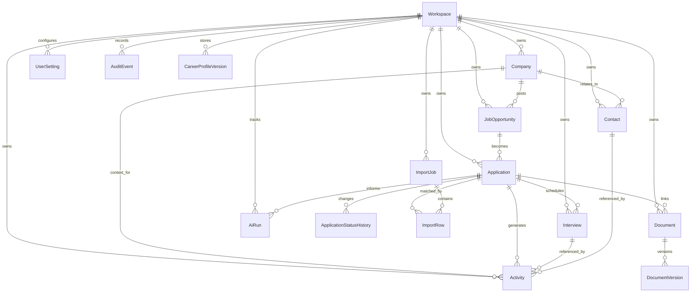

# Database Diagram

```mermaid
erDiagram
  Workspace ||--o{ Company : owns
  Workspace ||--o{ JobOpportunity : owns
  Workspace ||--o{ Application : owns
  Workspace ||--o{ Activity : owns
  Workspace ||--o{ Contact : owns
  Workspace ||--o{ Interview : owns
  Workspace ||--o{ Document : owns
  Workspace ||--o{ ImportJob : owns
  Workspace ||--o{ UserSetting : configures
  Workspace ||--o{ AuditEvent : records
  Workspace ||--o{ CareerProfileVersion : stores
  Workspace ||--o{ AiRun : tracks

  Company ||--o{ JobOpportunity : posts
  Company ||--o{ Contact : relates_to
  Company ||--o{ Activity : context_for

  JobOpportunity ||--o{ Application : becomes
  Application ||--o{ ApplicationStatusHistory : changes
  Application ||--o{ Activity : generates
  Application ||--o{ Interview : schedules
  Application ||--o{ Document : links
  Application ||--o{ AiRun : informs
  Application ||--o{ ImportRow : matched_by

  Interview ||--o{ Activity : referenced_by
  Contact ||--o{ Activity : referenced_by

  Document ||--o{ DocumentVersion : versions
  ImportJob ||--o{ ImportRow : contains
```
